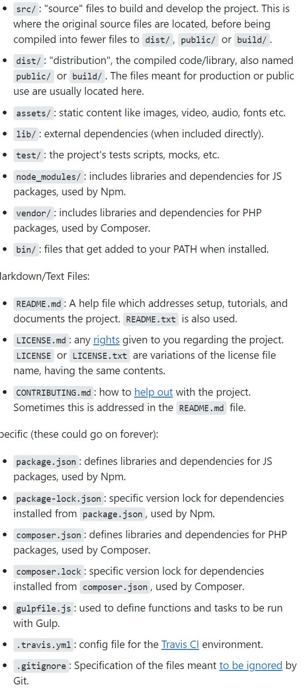

# node.js

* node.js is a sqynchronous javascript runtime environmanr that executes javascript code outside of a browser.
* **npm** Node Package Manager, is the default package manager for Node.js. It is distributed with Node.js, which means that when you download Node.js, npm is automatically installed on your computer!
* **inquirer** is an embeddable command-line interface for Node.js that makes it easy to ask questions, validate answers, parse input, provide error feedback, and manage hierarchical prompts.

# what will learn after this project

* idnetify the purpose Node.js serves in modern web development and when to use it.
* Create and execute a Node.js application from the command line.
 * Outline the differences betwen the javascript syntax we have used & the new ES6 features in order to uinderstand the purpose thewy serve in javascript.

 **Web developers commonly create or use tools that automate tasks from the command line, like generating webpages, creating README.md files, and even downsizing image folders.**

 * in the frontend projects we used to create a HTML file then script the javascript file path to activate the javascript but in node.js we dont need to do all those steps jsut create a javascript file and use the command line to execute it.

 ## Node.js removes certain limitations for JavaScript developers. Some popular uses for Node.js include the following:

* Creating web servers for a client to make a request to

* Communicating in real time with a chat or livestream

* Cleaning up and optimizing code

* Using the Internet of Things (IoT), such as controlling a thermostat or lights in a house

* Node.js, also known simply as Node, is a versatile runtime environment used to develop many types of projects, including build tools like document generators, servers that host websites or databases, and chat rooms.

* to check the node version type **node --version** in the terminal

# node [file system](https://nodejs.org/dist/latest-v12.x/docs/api/fs.html)
* According to the documentation and the examples, this function can create multiple file types, including TXT, PDF, HTML, JSON, and more. The fs.writeFile() function definition has three arguments. The first argument is the name of the file that's being created. The next argument is the data that will write onto the file, in this case the HTML template literal. The last parameter is a callback function that will be used for error handling.
* In the fs module, all functions have synchronous and asynchronous versions, including **fs.writeFile()** and **fs.writeFileSync()** [learn more](https://nodejs.org/dist/latest-v12.x/docs/api/fs.html#fs_fs_writefile_file_data_options_callback).

* advantages of haveing an async function handle a file-writing process?
    -  Writing data to a file can strain a computer's resources. Handling this process asynchronously allows the computer to run the process in the background, freeing up resources to continuously execute the current program without halting the runtime. 

* **common js** module sytem is used in the node.js to handle modules.
* **modules** are simple, complex and multiple javascript files that are reusable throughout our applications.

# different type of folder name convensions dist/distribution folders.

**NOde Package Manager npm** is first and foremost an online repository used for publishing open source code. It is also a command-line utility that we'll use to install the code packages or module bundles into the project. We'll dive deeper into these topics soon.

